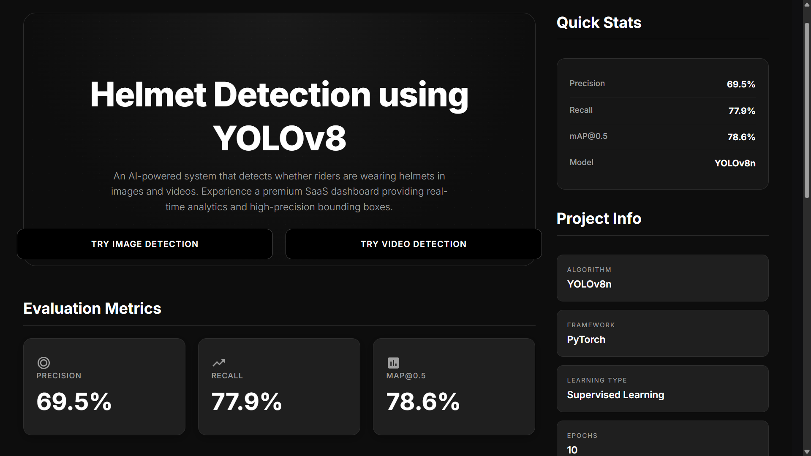
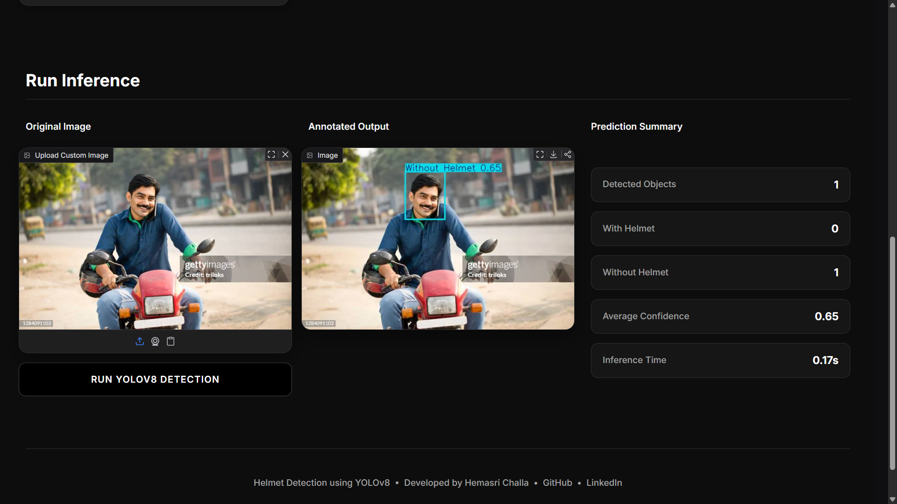
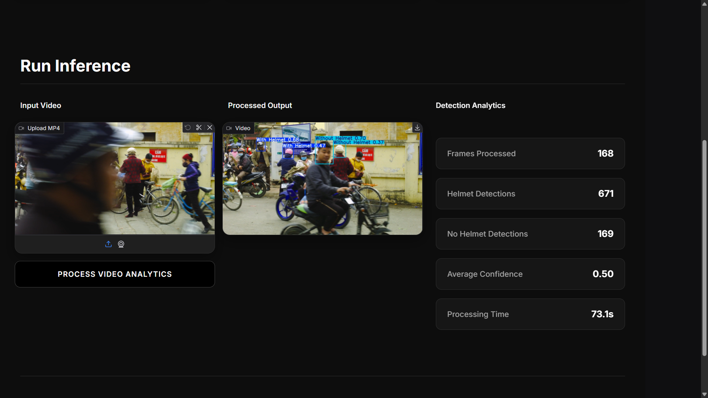

# Helmet Detection using YOLOv8

A computer vision application that detects whether motorcycle riders are wearing helmets using a custom-trained **YOLOv8** object detection model. The application supports image and video inference through an interactive **Gradio** interface.

## Live Demo

**Deployment:** https://helmet-detection-bv8d.onrender.com/

> **Note:** The application is hosted on a free cloud instance. Image detection is fully supported. Video upload inference may be slower or unavailable due to compute limitations. Demo videos showcase the complete video detection capability.

---

## Features

- Helmet detection using YOLOv8
- Image upload with real-time object detection
- Video upload support
- Preprocessed demo videos with detection results
- Interactive Gradio web interface
- Detection summary with confidence scores
- Model evaluation dashboard

---

## Tech Stack

- Python
- YOLOv8 (Ultralytics)
- PyTorch
- OpenCV
- Gradio

---

## Model Performance

| Metric | Score |
|---------|-------|
| Precision | 69.5% |
| Recall | 77.9% |
| mAP@0.5 | 78.6% |

---

## Screenshots

### Dashboard

<p align="center">

</p>

### Image Detection

<p align="center">

</p>

### Video Detection

<p align="center">

</p>

---

## Project Workflow

```text
                   User
                     │
                     ▼
            Gradio Web Interface
                     │
        ┌────────────┴────────────┐
        │                         │
        ▼                         ▼
  Image Upload             Video Upload
        │                         │
        └────────────┬────────────┘
                     ▼
          YOLOv8 Object Detection
                     │
                     ▼
      Bounding Box & Confidence Score
                     │
                     ▼
      Detection Summary Generation
                     │
                     ▼
       Annotated Image / Video Output
                     │
                     ▼
             Display Results
```

---

## Run Locally

### 1. Clone the repository

```bash
git clone https://github.com/hemasri0106-cell/helmet-detection.git
```

### 2. Navigate to the project

```bash
cd helmet-detection
```

### 3. Install dependencies

```bash
pip install -r requirements.txt
```

### 4. Run the application

```bash
python app.py
```

### 5. Open in your browser

```
http://127.0.0.1:7860
```

---

## Author

**Hemasri Challa**

GitHub: https://github.com/hemasri0106-cell
